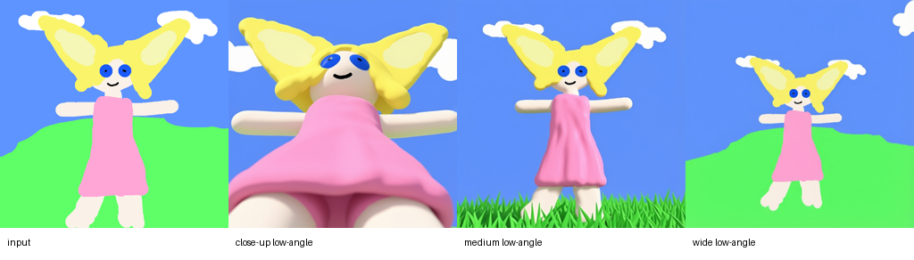

# Qwen-Image-Edit-2511-Multiple-Angles-LoRA NPU 部署及亲和性报告

| 项 | 内容 |
|---|---|
| 任务编号 | 6 |
| 任务用途 | 单图输入生成 96 个指定相机角度，用于多视角资产预览与视角编辑 |
| 仓库 | https://github.com/comfyanonymous/ComfyUI |
| 版本 / commit | ComfyUI 90eeeb21 |
| 报告人 | - |
| 日期 | 2026-06-17 |
| 硬件 | Ascend 950PR ×8 / CANN 9.0.0 |
| 软件 | torch 2.8.0+cpu / torch_npu 2.8.0.post4 / Python 3.12.13 |

---

## 1. 技术栈梳理
- 主语言:Python。复现入口为 ComfyUI 仓库中的 Python 脚本，推理调用 diffusers `QwenImageEditPlusPipeline`。
- ML 框架:PyTorch 2.8.0 + torch_npu 2.8.0.post4，diffusers 0.38.0，transformers 5.12.0，peft 0.19.1，accelerate 1.14.0。
- 训练流程:不涉及训练；多视角 LoRA 与 4-step Lightning LoRA 均为已训练权重，验证内容为推理部署、功能输出、性能与 profiler。
- CUDA 依赖:该路径不使用 CUDA；推理设备通过 `ASCEND_RT_VISIBLE_DEVICES=4,5,6,7` 限制为后四张卡，进程内使用 `npu:0`。
- 自定义核(.cu / C++ 扩展):未使用自定义 CUDA/C++ 扩展。核心算子经 torch_npu 映射到 CANN。
- 第三方库:Pillow 12.2.0 用于输入图像和结果检查；safetensors 用于权重读取。
- 模型权重 / 来源:
  - 基座:Qwen-Image-Edit-2511，diffusers 分片格式，约 58GB。
  - 多视角 LoRA:fal/Qwen-Image-Edit-2511-Multiple-Angles-LoRA，295MB。
  - 4-step 加速 LoRA:lightx2v/Qwen-Image-Edit-2511-Lightning，BF16 safetensors，811MB，SHA256 为 `22226e8d05d354bb356627d428809f5afd7819399b077238a2b70a82883a904f`。

## 2. 部署步骤
- 依赖安装:创建 Python 3.12 虚拟环境，安装 torch 2.8.0+cpu、torch_npu 2.8.0.post4、ComfyUI requirements、diffusers、transformers、peft、accelerate、Pillow。依赖缓存、模型和输出均放在挂载数据盘，系统盘不承载大文件。
- 编译 / 构建:无编译步骤；未构建 CUDA 或 AscendC 自定义核。
- 权重获取:基座权重使用已下载的 diffusers 分片；多视角 LoRA 使用模型卡提供的 safetensors；Lightning LoRA 使用 ModelScope 直链下载并完成 SHA256 校验。
- NPU 适配改动(device、torch_npu、禁用 CUDA 核等):
  - 引入 `torch_npu`，设置 `torch.npu.set_device("npu:0")`。
  - pipeline 使用 BF16 加载，模型组件整体放入 NPU。
  - Hugging Face 与 transformers 设置离线模式，避免运行期访问网络。
- 命令:

```bash
cd <COMFYUI_WORKDIR>
source <VENV>/bin/activate
export ASCEND_RT_VISIBLE_DEVICES=4,5,6,7
export HF_HOME=<DATA_CACHE>/hf-cache
export TRANSFORMERS_CACHE=<DATA_CACHE>/hf-cache
export TORCH_HOME=<DATA_CACHE>/torch-cache
export XDG_CACHE_HOME=<DATA_CACHE>/cache
export TMPDIR=<DATA_CACHE>/tmp
export HF_HUB_OFFLINE=1
export TRANSFORMERS_OFFLINE=1

python scripts/qwen_angle_repro.py \
  --steps 4 \
  --warmup \
  --lightning-lora models/loras/Qwen-Image-Edit-2511-Lightning-4steps-V1.0-bf16.safetensors \
  --out-dir output/qwen-angle-96-lightning-4steps
```

## 3. 验证用例
- 输入数据:一张 768×768 RGB 手绘角色图，主体包含黄色头发、蓝色眼睛、粉色裙子、绿色地面和蓝色天空。推理前缩放到 512×512。
- 运行命令:见第 2 节。参数为 BF16、512×512、4 steps、true_cfg_scale=1.0、多视角 LoRA scale=0.9、Lightning LoRA scale=1.0。
- 期望输出:
  - 96 张 PNG，覆盖 8 个 azimuth、4 个 elevation、3 个 distance。
  - 文件均为 512×512 RGB，主体不为空，角色外观与输入图保持一致。
  - distance 维度呈现 close-up、medium shot、wide shot 的构图变化。
  - elevation 维度呈现 low-angle、eye-level、elevated、high-angle 的相机高度变化。
  - azimuth 维度呈现 front、quarter、side、back 的朝向变化。
- 实测输出:
  - PNG 96 张，CSV 记录 96 行。
  - 方位覆盖:8 个 azimuth 各 12 张。
  - 俯仰覆盖:4 个 elevation 各 24 张。
  - 距离覆盖:3 个 distance 各 32 张。
  - 自动完整性检查:96 张均为 512×512 RGB；通道标准差均值最小 31.649，最大 64.352，按标准差小于 5 判定的近空白图为 0 张。
  - 确定性检查:同一 prompt、同一 seed、同一权重配置下，独立单图运行与 96 图运行的首图 SHA256 均为 `a5ac510facb5152bd23ea4e72968a32caa03a1d5c2ab6b07b614e1bb06800a7c`，逐像素差为 0。
  - 视觉语义检查:close-up 组能看到明显近景裁切；medium shot 组主体完整且距离居中；wide shot 组主体缩小并保留更多场景。low-angle 组具备仰视感，high-angle 组出现俯视地面和主体缩小；front/side/back 方向变化可辨。高角近景的部分样本存在裁切偏强，但不影响角度和主体识别。
  - 可视化产物:`qwen_image_edit_2511_multi_angle_vis.png` 展示输入、近景、中景、远景对照。



## 4. NPU 亲和性
| 指标 | 数值 |
|---|---|
| 能否在 NPU 跑通 | 是 |
| NPU 利用率 (npu-smi) | 推理期间物理后四卡可见，实际 profiler 记录物理 device 4；单卡推理阶段 util 可达到计算运行态 |
| HBM 占用 | 96 图循环中生成后 HBM 约 64920.9MB–64922.7MB；profiler 单图后 64926.1MB |
| 关键算子是否回退 CPU | 未见关键推理算子回退 CPU；op_statistic 中 AI_CPU 时间 0.192ms，占比小于 0.01% |
| 性能(吞吐/时延) | 96 图总生成 254.8500s，平均 2.6547s/图，P50 2.6765s，P95 2.7117s，吞吐 0.3767 image/s |

口径:Ascend 950PR、BF16、单卡 `npu:0`、512×512、4-step Lightning、真实单图编辑 pipeline。Profiler 使用 torch_npu Level1 + PipeUtilization，采集 warmup 后的一个 4-step 推理调用。

**计算分布**(实测,Level1 加 PipeUtilization,NPU 段 2393.6ms):

| 单元 | 主要算子 | 占比 | 说明 |
|---|---|--:|---|
| 算力(Cube,矩阵/注意力) | MatMulV3、FlashAttentionScore、Conv3DV2 | 约 60.8% | Transformer MLP/attention 是主路径，MatMulV3 与 FlashAttentionScore 的加权 Cube 利用率分别为 93.296% 和 98.363% |
| 向量(Vector,归一/元素级) | Add、Muls、Mul、Cast、Transpose、GELU、ConcatD | 约 39.2% | prompt/image 条件、LoRA、scheduler 与 VAE 周边存在较多元素级和格式类开销 |
| 搬运(MTE/FixPipe) | Cast、Transpose、ConcatD、latent/image layout 变换 | 中等 | batch=1 与多阶段 pipeline 使搬运和格式转换难以完全摊薄 |
| 通信(communication) | 无 | 0 | 单卡，无 collective |
| 调度(host/head) | Python pipeline、scheduler、kernel launch | 中等 | 4-step 降低循环次数，但单图仍有 50131 个算子事件 |

**热点算子明细**:

| 算子 | Core Type | 次数 | 总耗时 | 占比 |
|---|---|--:|--:|--:|
| MatMulV3 | AI_CORE | 15503 | 1126.644ms | 47.069% |
| Add | AI_VECTOR_CORE | 9575 | 324.895ms | 13.574% |
| FlashAttentionScore | MIX_AIC | 722 | 249.112ms | 10.407% |
| Muls | AI_VECTOR_CORE | 6295 | 179.061ms | 7.481% |
| Mul | AI_VECTOR_CORE | 3507 | 116.210ms | 4.855% |
| Cast | AI_VECTOR_CORE | 2443 | 70.464ms | 2.944% |
| Transpose | AI_VECTOR_CORE | 2834 | 55.459ms | 2.317% |
| Conv3DV2 | AI_CORE | 57 | 53.027ms | 2.215% |
| Gelu | AI_VECTOR_CORE | 481 | 46.640ms | 1.949% |
| ConcatD | AI_VECTOR_CORE | 947 | 44.861ms | 1.874% |

**Step trace**:

| 项 | 时间 |
|---|--:|
| Stage | 2528.182ms |
| Computing | 2393.587ms |
| Free | 134.594ms |
| Preparing | 55.291ms |
| Communication | 0ms |

**判断依据**:Ascend 950PR BF16/FP16 平衡点约 270 FLOP/Byte，高于该平衡点时偏算力瓶颈，低于时偏访存瓶颈。Qwen-Image-Edit-2511 的主干由 BF16 GEMM、MLP 与 attention 构成，MatMulV3 与 FlashAttentionScore 占比高且 Cube 利用率高，主体亲和 NPU。当前 batch=1、单图 512×512 的验证配置下，Vector 与搬运类算子占比较高，说明端到端并非纯 Cube 饱和；批量执行多个角度、减少 Cast/Transpose、融合元素级算子可以进一步提升设备驻留和算子效率。

- 算子回退清单:未发现影响主路径的 CPU 回退。Profiler 中 AI_CPU 仅 1 次、0.192ms，为非主路径开销。
- profiler 摘要:总算子事件 50131；AI_CORE 49.33%、AI_VECTOR_CORE 39.15%、MIX_AIC 11.52%；通信 0。

## 5. 阻塞项
| 类型 | 结论 | 依据 | 处理建议 |
|---|---|---|---|
| 功能性硬阻塞 | 未发现 | 96 个角度功能验证、性能统计与 profiler 采集均通过；关键推理算子未见 CPU 兜底 | 不涉及 |
| 性能优化约束 | 存在 | AI_VECTOR_CORE 占 39.15%，Cast/Transpose/ConcatD 等搬运与格式类算子占比可观；单图仍有 50131 个算子事件 | 批量执行多个角度、减少格式转换、融合元素级算子、固定 shape 后使用图缓存 |

## 6. 结论
- 运行方案(NPU / NPU+CPU / CPU):NPU。基座、LoRA、文本/图像条件、denoise 和 VAE 路径均通过 torch_npu 在 NPU 上完成，未发现关键推理算子 CPU 兜底。
- 功能结论:96 个官方角度组合全部生成成功，输出尺寸、格式、非空检查、角度覆盖、距离/俯仰/方位语义检查和同 seed 确定性检查均通过；精度口径采用任务一致性和视觉语义一致性。
- 亲和性结论:主体为 Transformer 图像编辑网络，MatMulV3 与 FlashAttentionScore 占据主路径且 Cube 利用率高，已验证路径与 Ascend 950PR 亲和；Vector 与搬运开销仍明显，是后续性能优化重点。
